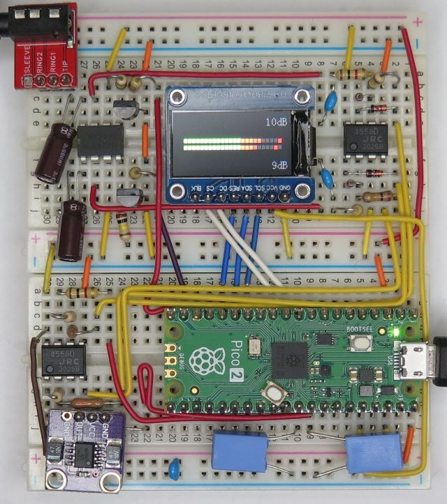

# Audio Level Meter for rp2350



[](https://github.com/elehobica/pico_level_meter/actions/workflows/build-binaries.yml)

## Overview
This is Audio Level Meter library for rp2350

This project feattures:
* Analog signal inputs for 2 channels
* Configurable dB scale steps and levels
* Preserved input attenuator values

## Supported Board and Peripheral Devices
* Raspberry Pi Pico 2
* M62429 / FM62429 Electric Volume
* ST7735S 80x160 LCD

## Pin Assignment
### Audio Input

| Pin # | Pin Name | Function | Signal Name |
----|----|----|----
|31 | GP26 | ADC0 | L_IN |
|32 | GP27 | ADC1 | R_IN |

### M62429 / FM62429 Electric Volume

| Pin # | Pin Name | Function | Signal Name |
----|----|----|----
|19 | GP14 | GPIO | PIN_FM62429_DATA |
|20 | GP15 | GPIO | PIN_FM62429_CLOCK |

## Schematic
The frontend analog circuit should be needed.

[pico_level_meter.pdf](doc/pico_level_meter.pdf)

## How to build with docker image
* This project targets rp2350 (Raspberry Pi Pico 2) only
* Builds the firmware inside [pico-sdk-dev-docker:sdk-2.3.0](https://hub.docker.com/r/elehobica/pico-sdk-dev-docker) (same image used by CI). Requires Docker; no local Pico SDK setup is needed.
* `build_docker.sh` drives the container build. Run it from the repository root.
```
$ git clone -b main https://github.com/elehobica/pico_level_meter.git
$ cd pico_level_meter
$ git submodule update -i
$ ./build_docker.sh           # build for Pico 2 (rp2350)  -> build/pico_level_meter.uf2
$ ./build_docker.sh -k        # incremental build (keep build directory contents)
```
* Outputs: `build/pico_level_meter.uf2` for Pico 2 (rp2350)
* Download "*.uf2" on RP2350 drive

## How to build in local
* This project targets rp2350 (Raspberry Pi Pico 2) only
* See ["Getting started with Raspberry Pi Pico"](https://datasheets.raspberrypi.org/pico/getting-started-with-pico.pdf)
* Put "pico-sdk", "pico-examples" and "pico-extras" on the same level with this project folder.
* Set environmental variables for PICO_SDK_PATH, PICO_EXTRAS_PATH and PICO_EXAMPLES_PATH
* Confirmed with Pico SDK 2.3.0
```
> git clone -b 2.3.0 https://github.com/raspberrypi/pico-sdk.git
> cd pico-sdk
> git submodule update -i
> cd ..
> git clone -b sdk-2.3.0 https://github.com/raspberrypi/pico-examples.git
>
> git clone -b sdk-2.3.0 https://github.com/raspberrypi/pico-extras.git
> 
> git clone -b main https://github.com/elehobica/pico_level_meter.git
> cd pico_level_meter
> git submodule update -i
> cd ..
```
### Windows
* Build is confirmed with Developer Command Prompt for VS 2022 and Visual Studio Code on Windows environment
* Confirmed with cmake-3.27.2-windows-x86_64 and gcc-arm-none-eabi-10.3-2021.10-win32
* Lanuch "Developer Command Prompt for VS 2022"
```
> cd pico_level_meter
> mkdir build && cd build
> cmake -G "NMake Makefiles" ..
> nmake
```
* Put "pico_level_meter.uf2" on RP2350 drive
### Linux
* Build is confirmed with [pico-sdk-dev-docker:sdk-2.3.0](https://hub.docker.com/r/elehobica/pico-sdk-dev-docker)
* Confirmed with cmake-3.22.1 and arm-none-eabi-gcc (15:10.3-2021.07-4) 10.3.1
```
$ cd pico_level_meter
$ mkdir build && cd build
$ cmake ..
$ make -j4
```
* Download "pico_level_meter.uf2" on RP2350 drive

### Serial interface usage
* type ' ' to display current settings
* type 's' to store current settings to Flash
* type '+' or '=' to decrease attenuation (level up)
* type '-' to increase attenuation (level down)
* type 'b' to adjust attenuation for both channels
* type 'l' to adjust attenuation for left channel
* type 'r' to adjust attenuation for right channel
* type 'p' to toggle peak hold mode