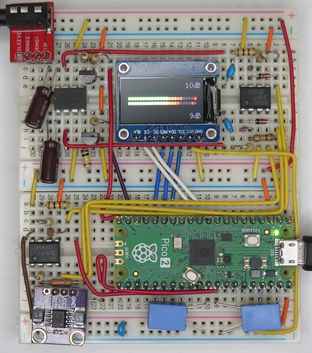

# Audio Level Meter for Raspberry Pi Pico



## Overview
This is Audio Level Meter library for Raspberry Pi Pico

This project feattures:
* Analog signal input for multiple channels (max 3 channels)
* Configurable dB scale steps and levels

## Supported Board
* Waveshare RP2040-LCD-0.96 Board (ST7735S 80x160 LCD build-in)
or
* Raspberry Pi Pico + ST7735S 80x160 LCD

## Pin Assignment
### ST7735S 80x160 LCD (Waveshare RP2040-LCD-0.96 Board)

| Pin # | Pin Name | Function | Signal Name |
----|----|----|----
|11 | GP8 | GPIO | DC |
|12 | GP9 | SPI1_CSn | CS |
|14 | GP10 | SPI1_SCK | SCL |
|15 | GP11 | SPI1_TX | DIN |
|16 | GP12 | GPIO | RST |
|-- | GP25 | GPIO | BL |

## Schematic
The frontend analog circuit should be needed.

[pico_level_meter.pdf](doc/pico_level_meter.pdf)

## How to build
* See ["Getting started with Raspberry Pi Pico"](https://datasheets.raspberrypi.org/pico/getting-started-with-pico.pdf)
* Put "pico-sdk", "pico-examples" (, "pico-extras" and "pico-playground") on the same level with this project folder.
* Build is confirmed in Developer Command Prompt for VS 2022 and Visual Studio Code on Windows enviroment
* Confirmed with Pico SDK 1.4.0, cmake-3.27.2-windows-x86_64 and gcc-arm-none-eabi-10.3-2021.10-win32
```
> git clone -b master https://github.com/raspberrypi/pico-sdk.git
> cd pico-sdk
> git submodule update -i
> cd ..
> git clone -b master https://github.com/raspberrypi/pico-examples.git
> 
> git clone -b main https://github.com/elehobica/pico_level_meter.git
```
* Lanuch "Developer Command Prompt for VS 2022"
```
> cd pico_level_meter
> mkdir build
> cd build
> cmake -G "NMake Makefiles" ..
> nmake
```
* Put "pico_level_meter.uf2" on RPI-RP2 drive